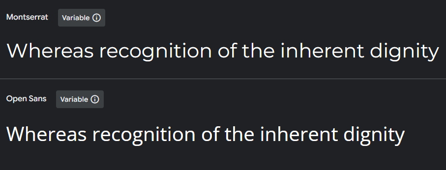

# Mental Health Awareness

## Overview

### Purpose

This single-page website aims to provide accessible information on mental health, including how to recognize common issues and manage stress, with links to external resources. The design will be welcoming and supportive, and will be achieved using HTML, CSS, and Bootstrap.

### Target Audience

- Individuals seeking beginner-friendly information about mental health.
- Individuals who may be mild mental health issues.
- People who are looking for tips to improve their mental health.
- Friends and family members of individuals dealing with mental health issues, looking to offer support.

## User Stories

### Must-Have:

- As a user, I want to see an encouraging message about mental health when I first visit the site, so I feel welcomed and supported.
- As a user, I want to easily find information about common mental health issues, so I can gain a comprehensive understanding.
- As a user, I want to access tips for managing stress, so I can apply them in day to day life.
- As a user, I want the website to have a calming color scheme and layout, so I feel at comfortable.
- As a user, I want to see calming images, to be better engaged in the page content.

Should-Have:

- As a user, I want to see a positive thoughts section, for motivation.
- As a user, I want access to external mental health resources, so I can find additional help if needed.
- As a user, I want the website to be fully responsive, so I can access it comfortably on any device.

Could-Have:

- As a user, I want to see subtle animations or transitions, so the website feels more engaging, without being too overwhelming.
- As a user, I want to be able to toggle between light and dark modes, so that I can choose what is most comfortable to me.

## Design Decisions

### Wireframe

A Simple layout, which is designed to be easily navigable and responsive. The number of cards in each section is arbitrary.

### Colour Scheme:

The colour scheme selected, was chosen to be calming, with contrast being considered for background and text.
- Primary: #7FDBFF (Light Blue)
- Secondary: #0074D9 (Darker Blue) 
- Accent: #2ECC40 (Green)
- Text: #001f3f (Dark Navy)
- Background: #F8F9FA (Off-White)

 

---

### Fonts:

The fonts were selected for their modern style, and high level of readability.
- Headings: 'Montserrat', sans-serif.
- Body: 'Open Sans', sans-serif.

 

## Features Implementation

