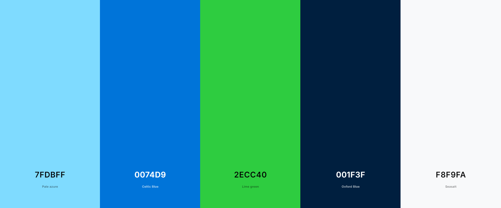
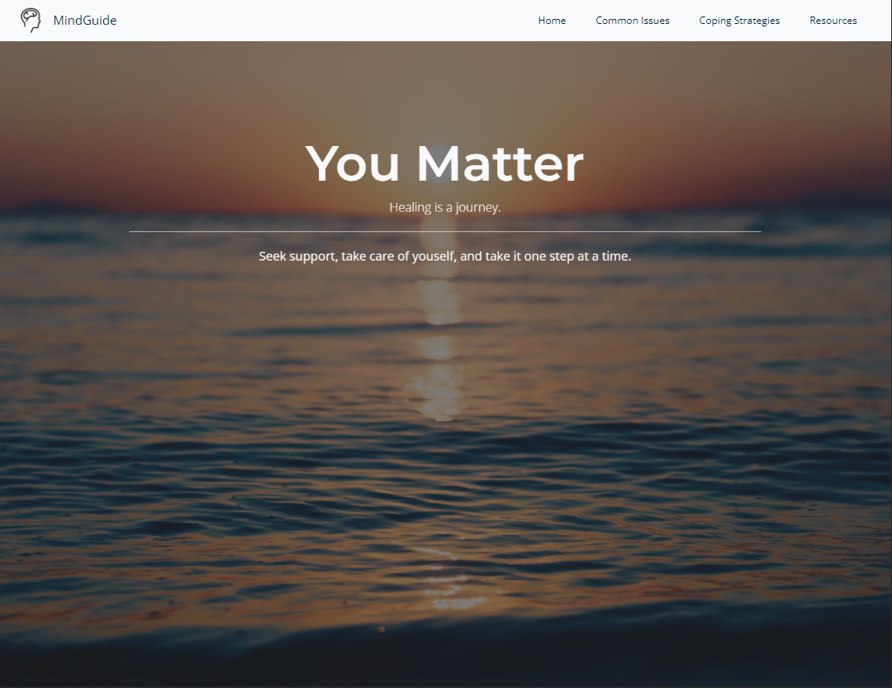

# Mental Health Awareness

## Overview

### Purpose

This single-page website aims to provide accessible information on mental health, including how to recognize common issues and manage stress, with links to external resources. The design will be welcoming and supportive, and will be achieved using HTML, CSS, and Bootstrap.

### Target Audience

- Individuals seeking beginner-friendly information about mental health.
- Individuals who may be mild mental health issues.
- People who are looking for tips to improve their mental health.
- Friends and family members of individuals dealing with mental health issues, looking to offer support.

## User Stories

### Must-Have:

- As a user, I want to see an encouraging message about mental health when I first visit the site, so I feel welcomed and supported.
- As a user, I want to easily find information about common mental health issues, so I can gain a comprehensive understanding.
- As a user, I want to access tips for managing stress, so I can apply them in day to day life.
- As a user, I want the website to have a calming colour scheme and layout, so I feel at comfortable.
- As a user, I want to see calming images, to be better engaged in the page content.

Should-Have:

- As a user, I want to see a positive thoughts section, for motivation.
- As a user, I want access to external mental health resources, so I can find additional help if needed.
- As a user, I want the website to be fully responsive, so I can access it comfortably on any device.

Could-Have:

- As a user, I want to see subtle animations or transitions, so the website feels more engaging, without being too overwhelming.
- As a user, I want to be able to toggle between light and dark modes, so that I can choose what is most comfortable to me.

## Design Decisions

### Wireframe

A simple layout, which is designed to be easily navigable and responsive. The number of cards in each section is arbitrary.

### Colour Scheme:

The colour scheme selected, was chosen to be calming, with contrast being considered for background and text.
- Primary: #7FDBFF (Light Blue)
- Secondary: #0074D9 (Darker Blue) 
- Accent: #2ECC40 (Green)
- Text: #001f3f (Dark Navy)
- Background: #F8F9FA (Off-White)

 

---

### Fonts:

The fonts were selected for their modern style, and high level of readability.
- Headings: 'Montserrat', sans-serif.
- Body: 'Open Sans', sans-serif.

 

## Features Implementation

### Core Features (Must-Haves)

1. As a user, I want to see an encouraging message about mental health when I first visit the site, so I feel welcomed and supported.
- Implemented a jumbotron, for the hero section of the page, covering the whole page.

 

2. As a user, I want to easily find information about common mental health issues, so I can gain a comprehensive understanding.
- Information is organised into sections, with nav bar elements linking to them.

 

3. As a user, I want to access tips for managing stress, so I can apply them in day to day life.
- Implemented a 'Coping Strategies' section, with tips on managing mental health.

 

4. As a user, I want the website to have a calming colour scheme and layout, so I feel at comfortable.
- Used a colour scheme, utilising an off-white background colour.
- Spaced the sections on the page so that that it is more easily navigable and readable.

 

5. As a user, I want to see calming images, to be better engaged in the page content.
- Added relevant nature-inspired images.

### Advanced Features (Should-Haves)

1. As a user, I want to see a positive thoughts section, for motivation.
- The first section, when scrolling down is a bootstrap card with an introduction and keeping positive section.

 

2. As a user, I want access to external mental health resources, so I can find additional help if needed.
- Added a resources section, with bootstrap cards, linking to external resources.

 

3. As a user, I want the website to be fully responsive, so I can access it comfortably on any device.
- Utilised bootrap classes and media queries to ensure full responsivity and ease of use on all devices.

### Optional Features (Could-Haves)

1. Added a smooth-scrolling feature when navigation links are clicked on.

2. Added a parallax to the hero image, for a smooth transition to the rest of the page.

## AI Tools Usage

### ChatGPT

ChatGPT was utilised in order to provide content for the page. Most of the page content was prompted, then modified in order to suit.

## Testing and Validation

### Testing finds

The site was tested on various screen sizes throughtout the creation process, the main issues found were with text spacing, which was fixed through the use of bootstrap margin and border classes. 

Additionally, bootstrap column classes were set up differently depending on the screen sizing, in order to increase readability on smaller devices. As a part of this, the tree image was resized and reshaped, so that it wouldn't take up the whole screen on smaller devices.

### Screenshots  taken from the deployed website:

 

    
    
    

### Validation

The HTML and CSS were validated using W3C and Jigsaw validators, with no errors found.

 

 

## Deployment

### GitHub Pages

The site was deployed using GitHub pages, from the main branch.

URL: https://oliver-tommy.github.io/Mental-Health-Awareness/

## Reflection on Development Process

## Code Attribution

## Future Improvements

